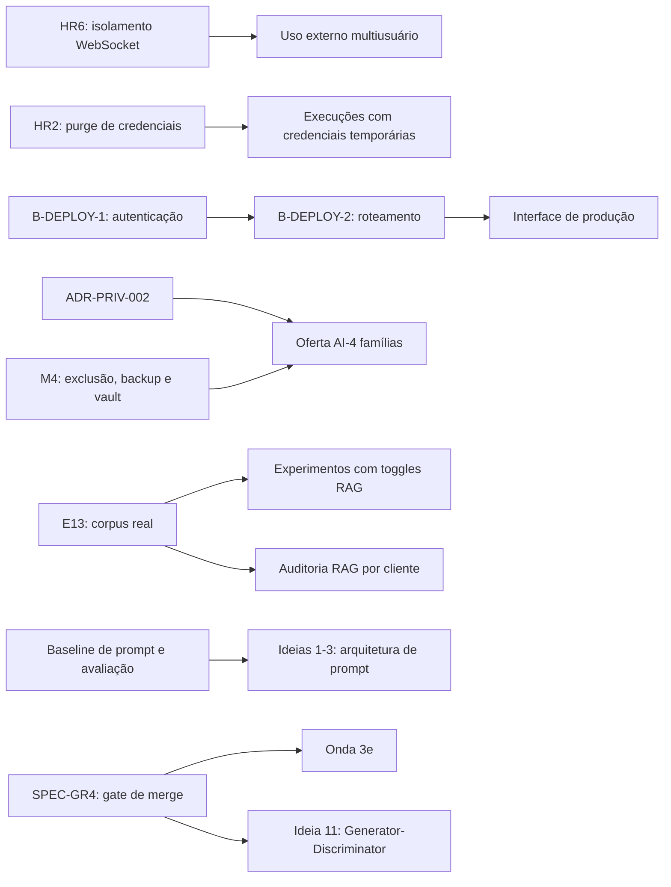

# Revisão crítica de prioridades, dependências, duplicações e riscos

**Projeto:** Assistente OS  
**Data de referência:** 4 de setembro de 2026  
**Autor:** Manus AI

## Conclusão executiva

O backlog atual contém riscos reais, mas **a ordem apresentada não é suficiente para orientar execução**. O documento mistura contenção de segurança, bloqueadores de produção, dívida técnica, tarefas operacionais, decisões de produto e experimentos condicionados a dados de clientes. A recomendação é separar o trabalho em quatro filas: **contenção**, **gate de produção**, **endurecimento estrutural** e **apostas condicionais**.

Dois itens devem permanecer no topo absoluto: **SPEC-HR6**, por risco de vazamento de eventos WebSocket entre contas, e **SPEC-HR2**, por risco de retenção indevida de credenciais temporárias. Ambos são controles de perda e justificam tratamento P0. O **BUG-01** deve entrar na mesma janela de correção, embora permaneça P1, porque a combinação de timeout sem cancelamento e Ollama com um único slot cria uma forma previsível de indisponibilidade autoinfligida.[1]

Antes de implementar vários itens de conformidade, é necessário fazer uma **auditoria curta de estado**. A documentação compartilhada afirma que todas as ferramentas MCP estão protegidas por Zero Trust, que `LANGGRAPH_MAX_ITERATIONS` já é guardrail efetivo, que a diretriz FinOps já está presente em toda resposta e que o fluxo Guardian com código humano já foi implementado.[3] [4] [8] O backlog mais recente registra partes desses mesmos controles como `TODO`.[1] Isso pode significar implementação parcial, regressão, requisito mais forte que o já entregue ou simples desatualização documental. Codificar sem verificar aumentaria o risco de duplicação e de correções no componente errado.

> **Decisão recomendada:** não promover automaticamente nenhuma ideia especulativa. Primeiro, conter os P0, reconciliar o estado real e fechar o caminho de produção. Depois, promover apenas hipóteses que tenham consumidor, métrica de sucesso e critério de descarte.

## 1. Repriorização recomendada

| Ordem | Pacote de trabalho recomendado | Origem | Prioridade recomendada | Motivo | Decisão |
|---:|---|---|---|---|---|
| 1 | **Isolamento WebSocket por conta/sessão** | SPEC-HR6 | P0 | Possível vazamento cross-tenant de `chat.step` e `graph.step`; impacto de confidencialidade e privacidade. | Corrigir imediatamente e adicionar teste de isolamento com dois clientes autenticados. |
| 2 | **Ciclo de vida de credenciais temporárias** | SPEC-HR2 + parte de M4 | P0 | Credencial pode sobreviver a sucesso, erro, timeout ou cancelamento; há sobreposição com o `temp-vault` citado em M4. | Consolidar em um único épico de purge, com `finally` e testes para todos os caminhos de saída. |
| 3 | **Cancelamento upstream do Ollama** | BUG-01 | P1, fila expedita | Com `-np 1`, uma chamada zumbi bloqueia todo o tier local depois que o cliente já recebeu timeout. | Entregar na mesma janela dos P0; elevar a P0 se houver indisponibilidade de produção observada. |
| 4 | **Auditoria de conformidade e reconciliação documental** | HR3, HR4, GR1, GR3, FO1 | P1 | Há contradição entre o backlog e os documentos que declaram esses mecanismos como entregues.[1] [3] [4] [8] | Verificar código e testes antes de criar novas implementações; reclassificar cada item como feito, parcial, regressão ou lacuna. |
| 5 | **Autenticação real da interface web** | B-DEPLOY-1 | P1 | O token fixo de build impede um fluxo de produção aceitável. | Definir sessão, expiração, logout e separação entre usuário e administrador antes do roteamento. |
| 6 | **Roteamento de produção da interface** | B-DEPLOY-2 + FM5 | P1 | É a porta de entrada do produto, mas depende da autenticação. FM5 é duplicação explícita. | Manter apenas B-DEPLOY-2 como item canônico e registrar FM5 como alias resolvido por ele. |
| 7 | **Degradação suave e gate de merge** | SPEC-HR1 + SPEC-GR4 | P1 | Reduz falhas totais e impede novas regressões em componentes de alto risco. | Entregar antes de refactors grandes ou automação autônoma. |
| 8 | **Semântica e acessibilidade do streaming** | DS14 + DS15 | P2, promover para gate de release público | Cursor infinito e ausência de anúncio para leitor de tela têm a mesma causa: o ciclo de vida do stream não está expresso. | Consolidar em um único pacote com estado de conclusão e região `role="log"`/`aria-live`. |
| 9 | **Privacidade AI-4 de famílias** | M4 + ADR-PRIV-002 | P0 condicional | É bloqueador absoluto se clientes de saúde/famílias forem expostos externamente; fora desse cenário, continua P1 estratégico. | Não lançar esse domínio externamente antes de retenção, exclusão, backup e ADR estarem fechados. |
| 10 | **Centralização incremental de configuração** | Onda 3d | P2 | Reduz drift de guardrails e aliases, mas não deve atrasar hotfixes de segurança. | Executar por fatias após a contenção; começar pelos controles de segurança e limites. |
| 11 | **Acessibilidade e Markdown** | DS10 + DS11; DS12 + DS13 | P2/P3 | Os pares compartilham componentes e critérios de teste. | Formar dois pacotes: renderização Markdown e comportamento de rolagem. |
| 12 | **Refactors amplos e streaming LangGraph token a token** | Onda 3e + B-FUTURE | P3 | Alto risco de regressão e pouco valor antes de estabilizar produção, testes e limites. | Adiar; preferir extrações pequenas guiadas por testes. |

A tarefa **OPS-01** não deveria consumir espaço de planejamento. Ela é limpeza operacional reversível e deve ser executada fora da fila de desenvolvimento, com registro simples da ação.[1]

## 2. Dependências que precisam ficar explícitas

O backlog atual registra alguns vínculos, mas não representa os bloqueios como uma rede. Isso favorece começar itens aparentemente pequenos que ainda não podem gerar valor.

| Dependência | Consequência prática |
|---|---|
| **B-DEPLOY-1 → B-DEPLOY-2** | Servir o novo build em `/` antes de ter sessão real apenas troca o lugar do problema do token fixo. |
| **SPEC-HR6 → uso externo multiusuário** | O produto não deve ser considerado seguro para múltiplas contas enquanto eventos forem broadcast sem isolamento. |
| **ADR-PRIV-002 + M4 → famílias/AI-4** | O inventário reconhece risco AI-4 e ADR dedicado ainda pendente.[4] A automação de onboarding não substitui os controles de retenção, exclusão e backup. |
| **E13/corpus real → toggles e auditoria RAG** | O próprio guia de avaliação exige consultas representativas e documentos esperados; sem corpus real, métricas viram smoke test, não evidência de qualidade.[5] |
| **Baseline de prompt → ideias 1, 2 e 3** | Alterar cláusulas, ordem de contexto e estrutura XML simultaneamente impede atribuir ganhos ou regressões a uma causa. |
| **SPEC-GR4 → Onda 3e e ideia 11** | Refactor de god-objects e automação do ciclo de desenvolvimento elevam o risco de regressão; precisam de gate confiável antes. |
| **Config centralizada → endurecimento sustentável** | Centralizar limites reduz drift, mas não é pré-requisito para corrigir HR4 ou outro hard-stop urgente. O hotfix vem primeiro; a migração estrutural vem depois. |
| **Cloudflare service token → automação remota/CI** | É uma ação externa de operação, com duas camadas de autenticação, e não uma feature do daemon.[6] Deve ficar em checklist de implantação, não no backlog de código. |

## 3. Duplicações, sobreposições e conflitos de estado

| Itens | Tipo | Avaliação crítica | Tratamento recomendado |
|---|---|---|---|
| **B-DEPLOY-2 / FM5** | Duplicação exata | Ambos tornam a interface amigável a porta de entrada padrão. O próprio backlog já reconhece a redundância.[1] | Um item canônico: B-DEPLOY-2. FM5 vira referência cruzada, sem esforço próprio. |
| **SPEC-HR2 / M4 temp-vault** | Sobreposição parcial | HR2 define o mecanismo de purge por tarefa; M4 descreve o risco de privacidade mais amplo. | Um épico de lifecycle de segredos, com subitem específico para famílias apenas quando houver regra adicional. |
| **SPEC-HR3 / afirmação de Zero Trust MCP** | Conflito de estado | README e MCPS afirmam que todas as tools estão protegidas; HR3 diz que handlers ainda precisam de autorização e auditoria.[3] [8] | Auditar handler por handler e publicar matriz de cobertura. Não assumir que catálogo/allowlist prova execução correta. |
| **SPEC-HR4 / guardrail LangGraph documentado** | Conflito de estado | O inventário lista `LANGGRAPH_MAX_ITERATIONS` como guardrail efetivo, enquanto o backlog pede hard-stop de cinco iterações.[1] [4] | Verificar se o limite é apenas configuração, se é aplicado em todos os caminhos e se há teste de não ultrapassagem. |
| **SPEC-GR1 / Guardian existente** | Implementação parcial provável | Código de seis dígitos e aprovação humana já estão documentados; o que parece faltar é o gatilho de três reincidências e a escrita coordenada nos arquivos de regras.[3] [4] | Reescrever o item para descrever somente o delta; não reconstruir o mecanismo de aprovação. |
| **SPEC-GR3 / ferramentas de browser existentes** | Implementação parcial provável | O catálogo já inclui árvore de acessibilidade, execução de correção e screenshot auditado.[3] | Verificar ordem obrigatória, sandbox CDP e evidência gerada. O requisito é um harness/política, não apenas tools soltas. |
| **SPEC-FO1 / diretriz FinOps documentada** | Conflito de escopo/estado | O README diz que toda resposta carrega diretriz FinOps fixa no system prompt; o item pede codificá-la no template de SOUL.[3] | Decidir a camada canônica. Evitar duplicar a mesma regra no prompt global e em cada soul. |
| **Ideias 1, 2 e 3** | Mesmo ponto de mudança | As três alteram a montagem de `context.ts` e podem interagir com cache, custo, fidelidade e comportamento. | Consolidar como um experimento de “arquitetura de prompt”, com mudanças isoladas e comparação A/B. |
| **Ideia 5 / Sales Intelligence existente** | Extensão de capacidade existente | `sales_get_lead_brief` já aparece no produto; a proposta a trata como parte a construir.[2] [3] | Fazer gap analysis. Prováveis deltas: `sales_prepare_demo`, ROI e embalagem em skill. |
| **Ideia 9 / `spec_grill_plan`** | Extensão de mecanismo existente | O validador P.Q.A. é um novo scorecard sobre uma capacidade de refinamento já entregue. | Implementar, se validado, como modo/auditoria do Spec Grill, não como subsistema paralelo. |
| **Ideia 10 / `soul_generate_aiia`** | Extensão de capacidade existente | A geração de `AIIA.md` já existe; faltam fluxo de onboarding, consentimento e artefatos regulatórios específicos.[2] [3] | Renomear para “orquestração de onboarding LGPD” e manter dependência explícita do ADR. |
| **Ideia 11 / Spec Grill + Guardian + worktrees** | Forte sobreposição arquitetural | A proposta recombina três subsistemas existentes e reduz revisão humana justamente onde o risco é maior. | Não promover. Primeiro medir o fluxo manual e automatizar apenas gargalos observados. |
| **Ideia 16 / WhatsApp nativo** | Duplicação sem consumidor | O canal Baileys já é nativo no daemon.[2] [3] | Encerrar como “não fazer”, salvo novo caso de uso de agente externo. |

## 4. Riscos principais

| Risco | Evidência | Impacto | Tratamento |
|---|---|---|---|
| **Vazamento cross-tenant por WebSocket** | SPEC-HR6 descreve broadcast sem isolamento.[1] | Crítico: exposição de conteúdo e metadados entre clientes. | Contenção imediata, namespaces por identidade e teste cross-tenant negativo. |
| **Retenção de segredos após execução** | SPEC-HR2 e M4 apontam ausência de purge consistente.[1] | Crítico: credenciais podem permanecer acessíveis além do necessário. | `finally` obrigatório, idempotência, telemetria sem segredo e testes de erro/timeout/abort. |
| **Falsa sensação de conformidade por documentação divergente** | O README declara backlog zerado em 27/08, enquanto o snapshot de 04/09 abre P0/P1.[1] [3] | Alto: decisões de release e auditoria baseadas em estado incorreto. | Definir uma única fonte de verdade e gerar status a partir de testes/evidências. |
| **Autenticação de produção subespecificada** | B-DEPLOY-1 só registra que o token fixo precisa sair.[1] | Alto: uma tela de login pode apenas deslocar o segredo para armazenamento inseguro. | Especificar sessão, expiração, revogação, logout, escopos e separação admin/usuário. |
| **Indisponibilidade do tier local** | Timeout não cancela Ollama; o servidor opera com um slot.[1] | Alto operacional: fila inteira bloqueada por requisição abandonada. | Propagar `AbortSignal`, observar encerramento upstream e testar liberação do slot. |
| **LGPD/AI-4 incompleto** | O inventário reconhece ADR dedicado pendente; M4 inclui backup e dados sensíveis.[1] [4] | Crítico se o domínio for usado com dados reais. | Gate de lançamento por domínio, não apenas por release geral. |
| **Mudanças de prompt sem baseline** | Ideias 1-3 usam estimativas não calibradas e prometem ganho de cache.[2] | Médio-alto: regressão de qualidade, custo ou instruções conflitantes. | Experimentos isolados, prompt hash, conjunto de avaliação e rollback. |
| **Refactor grande antes dos gates** | `handleChat` e `tools/src/index.ts` são god-objects; gate de merge ainda está aberto.[1] | Alto: regressão ampla e revisão difícil. | Extrair por fronteiras observáveis, uma fatia por vez, depois do gate de CI. |
| **Métricas RAG sem dado representativo** | O guia exige golden set por soul e consultas reais.[5] | Médio: otimização de benchmark artificial. | Não habilitar toggles em definitivo sem histórico e golden set real. |
| **Backlog sem distinção de tipo** | Código, ADR, dashboard externo, limpeza de dados e descoberta comercial aparecem juntos.[1] | Médio: prioridade perde significado e capacidade é alocada incorretamente. | Adotar classes de trabalho e filas separadas. |

## 5. Avaliação das ideias especulativas

| Ideia | Decisão recomendada | Justificativa |
|---:|---|---|
| 1–3 | **Fundir e experimentar; não promover como três features** | Todas alteram a arquitetura do prompt. A hipótese de prefix caching depende do comportamento dos provedores e não deve ser tratada como economia garantida. |
| 4 | **Promover apenas para uma fila comercial paralela** | É compilação de material e pode gerar valor sem risco técnico, mas não deve competir com P0/P1 de engenharia. |
| 5 | **Fazer gap analysis antes de promover** | Parte da capacidade comercial já existe. Promover apenas os deltas e somente se houver pipeline ativo. |
| 6 | **Manter condicional** | Exige dois ou mais clientes do mesmo nicho; antes disso, o catálogo seria especulativo. |
| 7 | **Vincular a E13 e ao golden set real** | Auditoria enterprise sem consultas reais e documentos esperados produz aparência de rigor, não evidência.[5] |
| 8 | **Validar oferta sem construir software** | Pode ser empacotada comercialmente com ativos atuais. Nova automação só depois de demanda. |
| 9 | **Pilotar como extensão do Spec Grill** | O score 15/20 precisa de calibração; começar como relatório, não como gate bloqueante. |
| 10 | **Aguardar ADR-PRIV-002 e reutilizar AIIA existente** | O núcleo do artefato já existe. O valor futuro está na orquestração e na evidência regulatória. |
| 11 | **Não promover** | Sobrepõe mecanismos existentes, cria risco de avaliação circular e reduz controle humano em merges. |
| 12 | **Validar canal manualmente** | Automatizar pipeline editorial antes de provar frequência e conversão transforma uma aposta de marketing em dívida de software. |
| 13 | **Adiar por falta de base estatística** | Scores e alertas preditivos sem histórico calibrado geram falsos positivos e baixa confiança. |
| 14 | **Bloquear por decisão de modelo de negócio** | Lago/Novu só têm valor com cobrança por uso e comunicação multicanal como requisitos reais. |
| 15 | **Tratar como infraestrutura puxada por consumidor** | Conectores devem entrar junto da feature que os usa. Google Drive pode ser priorizado separadamente se ingestão real virar requisito. |
| 16 | **Encerrar como duplicado** | WhatsApp já é capacidade nativa; um wrapper MCP não tem consumidor identificado. |

## 6. Critérios de aceite mínimos para os itens mais urgentes

| Item | Critério de aceite recomendado |
|---|---|
| **SPEC-HR6** | Dois clientes autenticados com identidades diferentes recebem apenas eventos autorizados; eventos sem identidade não usam broadcast global por padrão; testes cobrem reconexão e troca de sessão. |
| **SPEC-HR2** | `purgeCredentials(taskId)` é chamado exatamente de forma segura e idempotente em sucesso, falha, timeout, cancelamento e exceção durante cleanup; logs não contêm valores sensíveis. |
| **BUG-01** | O timeout do `/stream` aborta a requisição HTTP ao Ollama; o socket upstream fecha dentro de limite mensurável; uma segunda chamada consegue iniciar sem aguardar o descarte interno do servidor. |
| **B-DEPLOY-1** | Build de produção não contém token fixo; sessão expira e pode ser encerrada; tokens não aparecem em URL ou logs; usuário comum não obtém capacidade administrativa. |
| **B-DEPLOY-2** | `/` serve a interface nova, `/hud` exige privilégio administrativo, `/friendly.html` responde 301 para `/`, assets e fallback de SPA funcionam, e rotas têm testes automatizados. |
| **Auditoria HR3/HR4/FO1/GR1/GR3** | Cada requisito tem evidência de código, teste e status. Itens parciais são reescritos como delta concreto; itens concluídos saem do backlog. |

## 7. Sequência recomendada de execução

### Janela 0 — contenção e verdade operacional

Executar **SPEC-HR6**, **SPEC-HR2** e **BUG-01**. Em paralelo, remover as threads de teste e realizar a auditoria curta dos itens com conflito documental. A saída dessa janela deve incluir testes de regressão e uma atualização única da fonte de verdade.

### Janela 1 — gate de produção

Entregar **B-DEPLOY-1** antes de **B-DEPLOY-2**. Fechar a degradação suave de **SPEC-HR1**, o gate de merge de **SPEC-GR4** e o pacote **DS14+DS15**. Se a implantação expuser dados de famílias ou saúde, **ADR-PRIV-002 e M4 tornam-se bloqueadores de release**, não tarefas paralelas.

### Janela 2 — endurecimento sustentável

Executar a centralização de configuração por fatias, reconciliar dependências com a allowlist, criar o comando único de Definition of Done e dividir **SPEC-EP2** em duas frentes: política contra `any` e validação Zod em fronteiras. Depois, tratar os dois pacotes de Design System restantes.

### Fila de descoberta, sem compromisso de entrega

Medir toggles de RAG apenas com golden set real; rodar o spike BitNet como benchmark controlado, sem tratá-lo como correção do BUG-01; testar as ideias 1–3 como experimento de arquitetura de prompt; e manter E13 dependente de corpus de cliente.

## 8. Mudanças de governança do backlog

O backlog deveria adotar os campos **tipo**, **owner**, **bloqueia**, **evidência**, **critério de aceite** e **status verificado em**. A prioridade sozinha não distingue perda de dados, disponibilidade, documentação, descoberta e oportunidade comercial.

| Tipo proposto | Exemplos | Regra de gestão |
|---|---|---|
| **Incidente/controle de perda** | HR6, HR2, BUG-01 | Fila expedita, owner explícito, teste de regressão obrigatório. |
| **Gate de release** | B-DEPLOY-1/2, HR1, GR4 | Bloqueia implantação do escopo relacionado. |
| **Dívida estrutural** | Onda 3d, Onda 3e, HR5, EP2 | Executar incrementalmente e medir regressão. |
| **Conformidade/ADR** | ADR-PRIV-002, partes de M4 | Evidência e aceite de risco, não apenas merge de código. |
| **Operação externa** | Cloudflare service token, BitNet na máquina de deploy | Checklist/runbook separado do backlog de código. |
| **Experimento** | toggles RAG, ideias 1–3, BitNet | Hipótese, baseline, métrica, tempo limitado e critério de descarte. |
| **Aposta de produto/canal** | ideias 4–15 | Exige consumidor, owner de negócio e sinal de demanda. |

Também é necessário resolver a divergência entre o README, que ainda declara “backlog zerado”, e o snapshot de 04/09, que contém P0 e P1 abertos.[1] [3] A recomendação é tornar `docs/ROADMAP.md` a fonte canônica e fazer os demais documentos apontarem para ele, sem duplicar status manualmente.

## 9. Limite desta revisão

Os documentos-fonte citados pelo snapshot — `docs/ROADMAP.md`, os três arquivos `docs/BACKLOG-*` e a spec de threads/streaming — não estão presentes entre os arquivos compartilhados desta sessão. A revisão confrontou os dois anexos com README, arquitetura, inventário de IA, catálogo MCP, guia de RAG, Quick Start e runbook de Cloudflare disponíveis no projeto.[3] [4] [5] [6] [7] [8] [9] Antes de reescrever o backlog oficial, deve-se conferir o detalhe técnico e o histórico dos documentos-fonte no repositório principal.

## Referências

[1]: /home/ubuntu/upload/backlog-atual.md "Backlog Atual — Assistente OS, snapshot de 4 de setembro de 2026"
[2]: /home/ubuntu/upload/ideias-priorizadas.md "Ideias — Backlog Especulativo, Priorizado, 4 de setembro de 2026"
[3]: /home/ubuntu/projects/assistente-os-6e574e96/README.md "Assistente OS — README compartilhado do projeto"
[4]: /home/ubuntu/projects/assistente-os-6e574e96/AI-INVENTORY.md "Inventário de Sistemas de IA — Assistente OS"
[5]: /home/ubuntu/projects/assistente-os-6e574e96/RAG-EVAL.md "Avaliação de recuperação do RAG"
[6]: /home/ubuntu/projects/assistente-os-6e574e96/CLOUDFLARE-ACCESS.md "Cloudflare Access — Service Token"
[7]: /home/ubuntu/projects/assistente-os-6e574e96/ARCHITECTURE.md "Arquitetura do Assistente OS"
[8]: /home/ubuntu/projects/assistente-os-6e574e96/MCPS.md "MCPs do Assistente OS"
[9]: /home/ubuntu/projects/assistente-os-6e574e96/QUICKSTART.md "Quick Start — Assistente OS"
